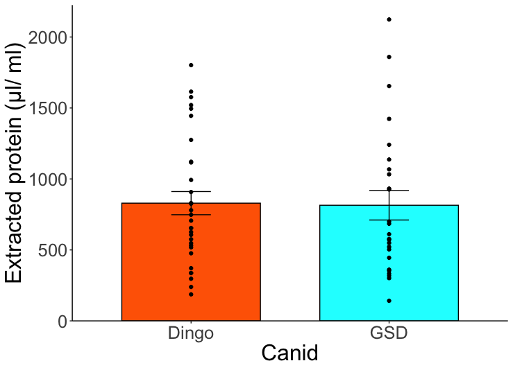

# R_graphing_snippets

These are R graphing snippets that I want to remember. I may not be too excited about the data that they present and the code may not be super clean, but they serve to refresh my memory.

## Snip 1
A Bar graph showing the mean and standard error with the data points overlaid, no jitter.

